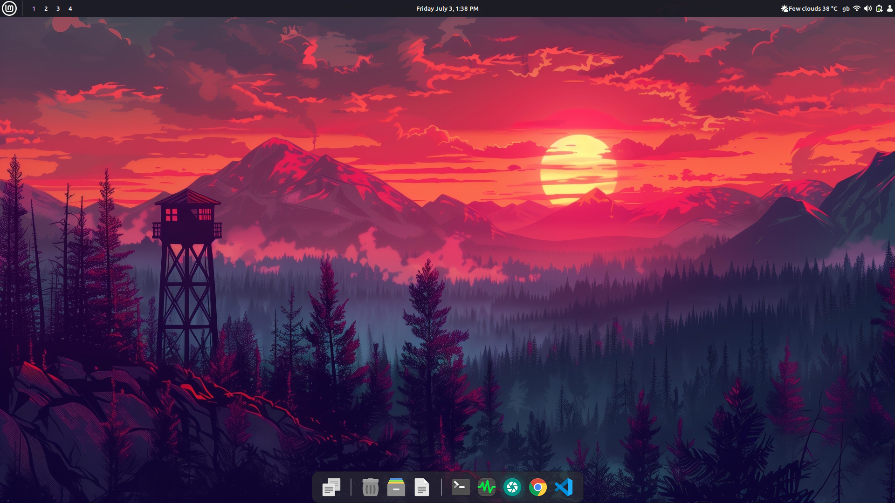

<div align="center">

<pre>
██╗    ██╗ █████╗ ██╗     ██╗     ██████╗  █████╗ ██████╗ ███████╗██████╗ ███████╗
██║    ██║██╔══██╗██║     ██║     ██╔══██╗██╔══██╗██╔══██╗██╔════╝██╔══██╗██╔════╝
██║ █╗ ██║███████║██║     ██║     ██████╔╝███████║██████╔╝█████╗  ██████╔╝███████╗
██║███╗██║██╔══██║██║     ██║     ██╔═══╝ ██╔══██║██╔═══╝ ██╔══╝  ██╔══██╗╚════██║
╚███╔███╔╝██║  ██║███████╗███████╗██║     ██║  ██║██║     ███████╗██║  ██║███████║
 ╚══╝╚══╝ ╚═╝  ╚═╝╚══════╝╚══════╝╚═╝     ╚═╝  ╚═╝╚═╝     ╚══════╝╚═╝  ╚═╝╚══════╝
</pre>

### *A curated collection of static & animated wallpapers* ✦

[](https://github.com/usman-369/wallpapers/stargazers)
[](https://github.com/usman-369/wallpapers/network/members)
[](LICENSE)
[](https://github.com/usman-369/wallpapers/commits)

</div>

---

## ✦ About

A handpicked personal wallpaper collection spanning **static images**, **solid colors**, and **animated/live wallpapers** curated for those who care deeply about what's behind their windows.

Whether you're ricing your Linux setup, refreshing your Windows desktop, or just tired of the default macOS backgrounds, there's something here for every aesthetic. (maybe)

> 📐 *Static wallpapers are mostly high resolution. Minecraft screenshots are 1080p (original captures). Animated wallpapers are mostly 1080p. Some animated wallpapers come in multiple FPS versions (60fps, 30fps, and lower) so you can pick what suits your setup.*

---

## 🖥️ Preview

### 🖼️ Static Wallpaper



### 🎞️ Animated Wallpaper


---

## 📁 Repository Structure

```text
wallpapers/
├── animated/
│   ├── abstract/
│   ├── cars/
│   ├── characters/
│   ├── misc/
│   └── scenery/
├── assets/
│   ├── preview-animated.gif
│   └── preview-static.png
├── static/
│   ├── abstract/
│   ├── automotive/
│   ├── characters/
│   ├── coding/
│   ├── colors/
│   ├── minecraft/
│   ├── misc/
│   └── scenery/
├── live_wallpaper.sh
├── LICENSE
└── README.md
```

---

## ⚡ Quick Download

### Clone the full collection

```bash
git clone --depth 1 https://github.com/usman-369/wallpapers.git
```

> Using `--depth 1` skips the full git history and speeds up the download significantly.

### Clone only static wallpapers (sparse checkout)

```bash
git clone --depth 1 --filter=blob:none --sparse https://github.com/usman-369/wallpapers.git
cd wallpapers
git sparse-checkout set static
```

### Clone only animated wallpapers

```bash
git clone --depth 1 --filter=blob:none --sparse https://github.com/usman-369/wallpapers.git
cd wallpapers
git sparse-checkout set animated
```

---

## 🛠️ Setting Wallpapers

<details>
<summary><b>🐧 Linux</b></summary>

**GNOME**

```bash
gsettings set org.gnome.desktop.background picture-uri "file:///path/to/wallpaper.jpg"
```

**KDE Plasma / Hyprland / Sway** — Use tools like **Waypaper**, **swww**, or **nitrogen** for static, and **mpvpaper** for animated wallpapers.

**Animated (using mpvpaper)**

```bash
mpvpaper -o "no-audio loop" '*' /path/to/wallpaper.mp4
```

</details>

<details>
<summary><b>🪟 Windows</b></summary>

**Static** — Right-click the image → *Set as desktop background*

**Animated** — Use **Lively Wallpaper** or **Wallpaper Engine** (paid) with `.mp4` / `.webm` files.
</details>

<details>
<summary><b>🍎 macOS</b></summary>

**Static** — Right-click image → *Use Image As Desktop Picture*

**Animated** — Use **HiDock** or **Plash** for video wallpapers.
</details>

---

## 🎞️ Animated Wallpaper on Linux Mint (Cinnamon / Nemo)

This repo includes `live_wallpaper.sh`, a script that uses `mpv` to play a video on the Nemo desktop window, turning it into a live wallpaper. It works by automatically detecting the Nemo desktop window ID using `xwininfo`, so no manual clicking is required.

**Dependencies:** `mpv` and `xwininfo` (part of `x11-utils`)

```bash
sudo apt install mpv x11-utils
```

### Usage

**One-time, with default video** (set your path inside the script):

```bash
./live_wallpaper.sh
```

**One-time, with a custom video path:**

```bash
./live_wallpaper.sh ~/Videos/wallpapers/rain.mp4
```

**Help:**

```bash
./live_wallpaper.sh --help
```

### Run on startup

To have your live wallpaper apply automatically on login, add the script to your startup applications:

1. Open **Startup Applications** (search for it in the app menu)
2. Click **Add**
3. Set the command to the full path of the script, e.g.:

   ```text
   /home/username/Videos/wallpapers/live_wallpaper.sh
   ```

   Or with a specific video:

   ```text
   /home/username/Videos/wallpapers/live_wallpaper.sh /path/to/video.mp4
   ```

4. Give it a name like `Live Wallpaper` and save

> **Note:** This script is written for **Linux Mint with Cinnamon** (Nemo desktop). It will not work on GNOME, KDE, or Wayland-based setups out of the box.

---

## 📋 Formats & Compatibility

| Format | Type | Best For |
|--------|------|----------|
| `.jpg` / `.jpeg` | Static | All platforms, smaller size |
| `.png` | Static | Lossless quality, transparency |
| `.mp4` | Animated | High-quality video wallpapers |
| `.mkv` | Animated | High-quality video with flexible codec support |
| `.webp` | Static | Modern browsers & apps |
| `.gif` | Animated | Lightweight loops |
| `.webm` | Animated | Linux-friendly video format |

---

## ⭐ Show Some Love

If you enjoy this collection, consider leaving a **star**. It helps others discover it and motivates adding more!

<div align="center">

[](https://github.com/usman-369/wallpapers)

</div>

---

## 📜 License

**MIT** License. All wallpapers are for **personal** use.

- 📸 Wallpapers in `static/minecraft/` and `static/colors/` are original assets made by me
- 🌐 All other wallpapers were collected from various sources across the internet

If you are the original creator of any image or video and would like credit or removal, please [open an issue](https://github.com/usman-369/wallpapers/issues) and I'll take care of it promptly.

---

<div align="center">

*Crafted with 🖤 by [usman-369](https://github.com/usman-369)*

</div>
